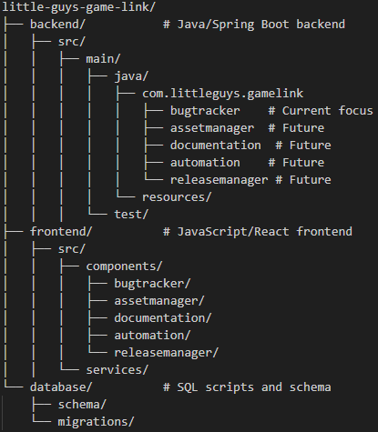

# Little Guys Game Link

A comprehensive game development tool suite designed for small studios using UE5, MetaHuman, CC4/CC5, iClone8, and Blender.

## Overview

Little Guys Game Link is an integrated development environment that streamlines game development workflows for small studios. Currently focusing on bug tracking, with planned expansions for asset management, documentation, automation, and release management.

## Project Structure

## Components

### Bug Tracking System (Current Focus)

- Issue reporting and tracking
- Platform-specific fields for UE5, MetaHuman, CC4/CC5, iClone8, and Blender
- Priority levels and assignments
- Screenshot/video attachment support
- Progress monitoring dashboard

#### Long-term development

- **Bug Tracking System**:
  - Core Features:
    - Platform-specific issue tracking for UE5 builds
    - Comprehensive performance monitoring
    - Specialized character pipeline support (MetaHuman/CC4/CC5)
    - Animation system debugging
    - 3D model import/export management
  - Specialized Features:
    - Visual documentation with screenshot/video capture
    - Version control integration
    - Automated issue assignment
    - Priority-based notifications
    - Performance metrics tracking (FPS, memory, load times)

### Long-term development of Future Components

- **Asset Management System**:
  - Core Features:
    - Centralized repository for all asset types
    - Version control integration
    - Platform-specific handling for UE5, MetaHuman, CC4/CC5, iClone8, and Blender
  - Technical Implementation:
    - Java backend for processing
    - React frontend for interactive previews
    - SQL database for metadata storage

- **Documentation Hub**:
  - Core Features:
    - Technical documentation
    - Workflow documentation
    - Tool integration guides
  - Collab Features:
    - Version-controlled documentation
    - Collaborative editing
    - Knowledge sharing

- **Task Automation Pipeline**:
  - Automation Capabilities:
    - Asset processing
    - Validation systems
    - Maintenance tasks
  - Integration Points:
    - Tool integration
    - Workflow automation

- **Release Manager**:
  - Core Features:
    - Build management
    - Dependency management
    - Deployment system
  - Quality Assurance:
    - Validation systems
    - Monitoring systems

## Technology Stack

- Backend: Java with Spring Boot
- Frontend: ReactJS
- Database: MySQL

## Development Roadmap

### Week 1-2: MVP

- Basic bug tracking functionality
- User authentication
- Simple workflow management
- Basic platform integration

### Week 3: Stretch Goals

- Advanced bug reporting features
- Enhanced tracking capabilities
- Integration enhancements
- Testing and polishing

## License

Little Guys Games
